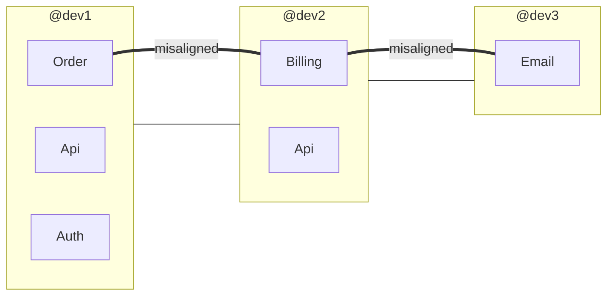

# Analyze Conway's Law Command

## Contents

- Key Concept
- Analysis Steps
- Output Format

You are an expert in forensic code analysis (per Adam Tornhill's "Your Code as a Crime Scene"). Your task is to audit **Conway's Law alignment** — comparing the team's organizational structure (who works on what) against the module dependency and coupling graph to find misalignments that predict integration bugs.

> [!important] Special Instruction
> Ignore any files under `arch-docs`, `vendor`, `node_modules`, `.git`, and `var` folders.

## Key Concept

Conway's Law states: "Organizations design systems that mirror their communication structures." When tightly coupled code is owned by separate teams/developers who don't communicate frequently, integration defects are almost guaranteed. Conversely, when a single developer owns loosely coupled modules, they may be over-engineering unnecessary connections.

## Analysis Steps

### 1. Map Developer-to-Module Ownership

**Time window**: Default window: `"6 months ago"`. Use this same value for ALL git log invocations below.

Determine which developers are the primary contributors to each module:

```bash
git log --since="{since}" --format="%aN" --name-only
```

For each top-level module/directory, compute the ownership distribution (who contributed what percentage of commits).

### 2. Build Module Coupling Graph

Identify which modules are coupled (files in different modules that change together):

```bash
git log --since="{since}" --format="COMMIT:%H" --name-only
```

For each commit, if files from different modules are changed together, that's a coupling signal. Count co-changes between each module pair.

### 3. Map Developer Communication Boundaries

Two developers are in the same "communication boundary" if they:
- Frequently commit to the same modules (shared context)
- Co-author or review each other's commits (if detectable via `Co-authored-by` trailers)
- Work in overlapping time windows on the same files

Developers who rarely touch the same code are in **separate communication boundaries**.

### 4. Detect Misalignments

A **Conway's Law misalignment** exists when:

| Pattern | Risk | Description |
|---------|------|-------------|
| **Coupled code, separate owners** | 🔴 High | Modules that change together are owned by developers who rarely interact |
| **Uncoupled code, shared owners** | 🟡 Low | One developer owns independent modules (inefficiency, not a defect risk) |
| **Boundary-crossing changes** | 🟠 Medium | Commits that touch multiple modules owned by different developers |

### 5. Quantify Misalignment

For each coupled module pair (A, B):

```text
alignment_score = overlap(owners_A, owners_B) / coupling_strength(A, B)
```

Where `overlap` measures how many developers contribute to both modules. A high coupling strength with low owner overlap is the danger signal.

### 6. Identify Integration Risk Zones

The highest-risk zones are where:
- Module coupling is strong (≥ 5 co-changes)
- Owner overlap is low (< 30%)
- The modules are in different directories/domains
- Bug-fix commits span both modules

## Output Format

### Conway's Law Analysis

**Repository:** {repo name}
**Period:** {start date} to {current date}
**Active developers:** {count}
**Modules analyzed:** {count}

### Developer-Module Ownership Map

| Module | Primary Owner | Ownership % | Secondary | Other Contributors |
|--------|--------------|-------------|-----------|-------------------|
| `src/Domain/Order/` | @dev1 | 65% | @dev2 (20%) | @dev3, @dev4 |
| `src/Domain/Billing/` | @dev2 | 72% | @dev3 (18%) | @dev1 |
| `src/Infrastructure/Api/` | @dev1 | 45% | @dev2 (30%) | @dev3 (25%) |

### Module Coupling Graph

| Module A | Module B | Co-Changes | Coupling Strength | Owner Overlap | Alignment |
|----------|----------|------------|-------------------|---------------|-----------|
| `Order/` | `Billing/` | 18 | 0.82 | 15% | 🔴 Misaligned |
| `Order/` | `Api/` | 12 | 0.65 | 70% | 🟢 Aligned |
| `Billing/` | `Email/` | 8 | 0.54 | 10% | 🔴 Misaligned |
| `Auth/` | `Api/` | 6 | 0.42 | 55% | 🟢 Aligned |

### Misalignment Details

For each 🔴 misaligned module pair:

---

#### `Module A` ↔ `Module B` — Alignment: 🔴 Misaligned

| Metric | Value |
|--------|-------|
| **Co-changes** | {count} commits |
| **Coupling strength** | {value} |
| **Module A primary owner** | @{dev} ({percentage}%) |
| **Module B primary owner** | @{dev} ({percentage}%) |
| **Owner overlap** | {percentage}% |
| **Cross-boundary commits** | {count} (commits touching both modules) |
| **Cross-boundary bug fixes** | {count} |

**Why these modules couple:**
- {analysis of co-change patterns — e.g., "Changes to Order entities require corresponding Billing adjustments"}
- {e.g., "Both modules share a database table or API contract"}

**Communication gap:** {e.g., "@dev1 owns Order and @dev2 owns Billing, but they have only 2 commits to each other's modules in 6 months. The coupling requires coordination they aren't doing."}

**Evidence of integration issues:**
- {e.g., "3 bug-fix commits span both modules, suggesting changes in one broke the other"}
- {e.g., "Commit messages include 'fix billing after order change' patterns"}

**Recommendation:**
- {e.g., "Assign shared ownership or establish a regular sync between @dev1 and @dev2 for Order/Billing changes"}
- {e.g., "Introduce an explicit interface/contract between the modules to reduce implicit coupling"}

---

### Cross-Boundary Commit Analysis

Commits that touch multiple modules with different owners:

| Commit | Author | Modules Touched | Owners Involved | Type |
|--------|--------|----------------|-----------------|------|
| `abc123` | @dev1 | Order, Billing | @dev1, @dev2 | Feature |
| `def456` | @dev2 | Billing, Email | @dev2, @dev3 | Bug fix |

**Cross-boundary commit rate:** {count} of {total} commits ({percentage}%)

### Communication Boundary Visualization



### Summary

| Metric | Value |
|--------|-------|
| Module pairs analyzed | {count} |
| Coupled pairs | {count} |
| Misaligned pairs | {count} ({percentage}%) |
| Cross-boundary commits | {count} |
| Cross-boundary bug fixes | {count} |
| Overall alignment score | {value}/100 |

### Recommendations

1. **Critical misalignment**: {most coupled misaligned pair — specific organizational action}
2. **Interface needed**: {module pair that should have an explicit contract}
3. **Ownership restructuring**: {suggestion for reassigning module ownership}
4. **Process**: {e.g., "Require cross-module PRs to be reviewed by both module owners"}


