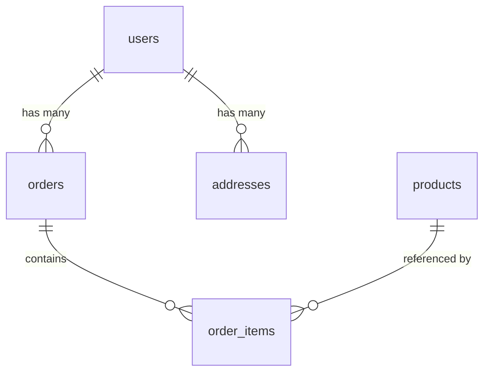

# Analyze Database Command

## Contents

- Database Analysis Requirements
- Output Format

You are a database architect. Analyze this codebase to identify and document all database interactions, schemas, and data persistence patterns.

> [!important] Special Instruction
> If no database interactions are detected after a comprehensive scan, return `no database`.

> [!important] Special Instruction
> Ignore any files under `arch-docs` folder.

## Database Analysis Requirements

### 1. Database Detection

Identify all databases used:

#### Relational Databases (SQL)
- PostgreSQL, MySQL, MariaDB
- SQLite, SQL Server, Oracle
- CockroachDB, TiDB

#### NoSQL Databases
- MongoDB, DynamoDB
- Cassandra, ScyllaDB
- CouchDB, RavenDB

#### Key-Value Stores
- Redis, Memcached
- etcd, Consul KV

#### Search Engines
- Elasticsearch, OpenSearch
- Solr, Algolia

#### Time Series
- InfluxDB, TimescaleDB
- Prometheus (storage)

#### Graph Databases
- Neo4j, Amazon Neptune
- ArangoDB, JanusGraph

### 2. For Each Database Found

Document the following:

---

### Database: [Name/Type]

**Type:** [Relational / Document / Key-Value / Search / Graph / Time Series]

**Purpose:** [What data this database stores and why]

**Connection Configuration:**
- Host/URL: [how configured - env var, config file]
- Port: [port used]
- Database name: [name or pattern]
- Connection pooling: [if configured]

**Access Method:**
- ORM/ODM: [Prisma, TypeORM, SQLAlchemy, Mongoose, etc.]
- Raw queries: [if used]
- Query builder: [Knex, Sequelize, etc.]

**Key Files:**
| File | Purpose |
|------|---------|
| `path/to/models/` | Model definitions |
| `path/to/migrations/` | Schema migrations |
| `path/to/config/db.ts` | Connection config |

---

### 3. Schema Documentation

#### Tables/Collections

For each table or collection:

##### Table: `table_name`

**Purpose:** [What this table stores]

**Columns:**
| Column | Type | Nullable | Default | Description |
|--------|------|----------|---------|-------------|
| id | uuid | No | gen_random_uuid() | Primary key |
| name | varchar(255) | No | - | Entity name |
| created_at | timestamp | No | now() | Creation time |

**Indexes:**
| Name | Columns | Type | Purpose |
|------|---------|------|---------|
| pk_table | id | Primary | Primary key |
| idx_name | name | B-tree | Search optimization |

**Relationships:**
| Relationship | Related Table | Type | Foreign Key |
|--------------|---------------|------|-------------|
| belongs_to | users | Many-to-One | user_id |
| has_many | items | One-to-Many | - |

### 4. Query Patterns

Document common query patterns:

#### Read Patterns
- Simple lookups by ID
- Complex joins
- Aggregations
- Full-text search

#### Write Patterns
- Single inserts
- Bulk operations
- Upserts
- Transactions

#### Code Examples
```[language]
// Show actual query patterns from the codebase
```

### 5. Data Access Layer

Document:
- **Repository Pattern**: If repositories are used
- **Service Layer**: Data access services
- **Direct Access**: Controllers/handlers with direct DB access
- **Caching Layer**: Query result caching

### 6. Migration Strategy

Document:
- **Migration Tool**: [Flyway, Alembic, Knex, Prisma Migrate, etc.]
- **Migration Location**: Where migrations are stored
- **Naming Convention**: How migrations are named
- **Rollback Support**: If rollbacks are possible

### 7. Performance Considerations

Identify:
- **N+1 Query Problems**: Potential or actual
- **Missing Indexes**: Queries without index support
- **Large Table Scans**: Unoptimized queries
- **Connection Pool Issues**: Configuration problems

### 8. Security Assessment

Check for:
- **SQL Injection Risks**: Raw query with user input
- **Sensitive Data Exposure**: Unencrypted PII
- **Access Control**: Database-level permissions
- **Connection Security**: SSL/TLS usage

## Output Format

### Database Overview

| Database | Type | Purpose | ORM/Driver |
|----------|------|---------|------------|
| PostgreSQL | Relational | Primary data | Prisma |
| Redis | Key-Value | Caching | ioredis |
| Elasticsearch | Search | Full-text search | @elastic/elasticsearch |

### Detailed Documentation

[For each database, provide the detailed documentation as specified above]

### Entity Relationship Diagram



### Summary

- **Total Databases:** [count]
- **Primary Database:** [name and type]
- **Total Tables/Collections:** [count]
- **Migration Status:** [up to date / pending]
- **Security Issues:** [count and brief list]


