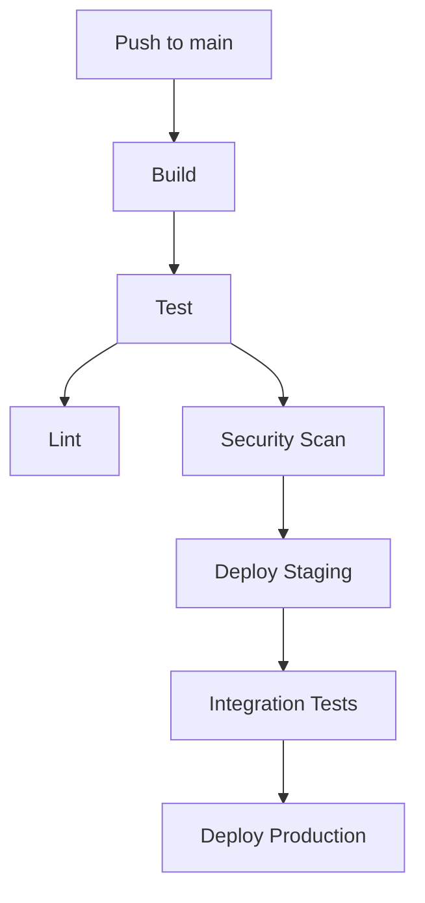

# Analyze Deployment Command

## Contents

- Deployment Analysis Requirements
- Output Format

You are a DevOps and infrastructure specialist. Analyze this codebase to identify and document all CI/CD pipelines, deployment mechanisms, and infrastructure configuration.

> [!important] Special Instruction
> If no deployment mechanisms are detected after a comprehensive scan, return `no deployment mechanisms detected`. Only document deployment mechanisms that are ACTUALLY present in the codebase. Do NOT list deployment tools, platforms, or practices that are not implemented.

> [!important] Special Instruction
> Ignore any files under `arch-docs` folder.

## Deployment Analysis Requirements

### 1. CI/CD Platform Detection

Identify CI/CD systems in use:

- **GitHub Actions**: `.github/workflows/`
- **GitLab CI**: `.gitlab-ci.yml`
- **CircleCI**: `.circleci/config.yml`
- **Jenkins**: `Jenkinsfile`
- **Azure DevOps**: `azure-pipelines.yml`
- **AWS CodePipeline**: `buildspec.yml`
- **Bitbucket Pipelines**: `bitbucket-pipelines.yml`
- **Travis CI**: `.travis.yml`
- **Drone**: `.drone.yml`

### 2. Pipeline Configuration

For each pipeline found:

---

### Pipeline: [Name/File]

**Platform:** [CI/CD platform]

**Location:** `path/to/config`

**Triggers:**
| Trigger | Condition |
|---------|-----------|
| Push | `main`, `develop` branches |
| Pull Request | All branches |
| Schedule | Daily at 2am |
| Manual | Workflow dispatch |

**Stages/Jobs:**

| Stage | Purpose | Dependencies |
|-------|---------|--------------|
| build | Compile code | - |
| test | Run tests | build |
| deploy | Deploy to env | test |

**Environment Variables:**
| Variable | Source | Purpose |
|----------|--------|---------|
| AWS_ACCESS_KEY | Secrets | AWS auth |
| DATABASE_URL | Secrets | DB connection |

---

### 3. Infrastructure as Code

Identify IaC tools:

#### Terraform
- Location: `terraform/` or `infrastructure/`
- Providers used
- State management (local, S3, Terraform Cloud)
- Modules defined

#### CloudFormation
- Template locations
- Stacks defined
- Parameters and outputs

#### Pulumi / CDK
- Language used
- Stacks defined
- Resources managed

#### Ansible / Chef / Puppet
- Playbooks/recipes/manifests
- Inventory management
- Role definitions

### 4. Container Configuration

#### Docker
- `Dockerfile` locations and purposes
- Base images used
- Multi-stage builds
- Build arguments

#### Docker Compose
- Services defined
- Networks configured
- Volumes mounted
- Environment handling

#### Kubernetes
- Deployment manifests
- Services and ingress
- ConfigMaps and Secrets
- Helm charts

### 5. Deployment Targets

Identify deployment environments:

| Environment | Platform | URL/Endpoint | Deployment Method |
|-------------|----------|--------------|-------------------|
| Development | Local | localhost:3000 | docker-compose |
| Staging | AWS ECS | staging.app.com | GitHub Actions |
| Production | AWS ECS | app.com | GitHub Actions |

### 6. Build Process

Document:
- **Build Commands**: How the application is built
- **Build Artifacts**: What gets produced
- **Dependency Installation**: How deps are installed
- **Asset Compilation**: Frontend build process

### 7. Testing in Pipeline

Document test stages:
- **Unit Tests**: Framework and command
- **Integration Tests**: Setup and execution
- **E2E Tests**: Tools and configuration
- **Code Coverage**: Thresholds and reporting
- **Security Scans**: SAST/DAST tools

### 8. Deployment Strategy

Identify:
- **Blue/Green Deployment**: If configured
- **Rolling Updates**: Update strategy
- **Canary Releases**: Percentage rollout
- **Feature Flags**: Deployment toggles

### 9. Rollback Mechanisms

Document:
- **Automated Rollback**: Failure conditions
- **Manual Rollback**: Process/commands
- **Database Rollback**: Migration reversal
- **Version History**: Artifact retention

### 10. Security Assessment

Check for:
- **Hardcoded Secrets**: In config files
- **Secret Management**: How secrets are handled
- **Least Privilege**: IAM/permissions
- **Vulnerability Scanning**: Container/dependency scans

## Output Format

### CI/CD Overview

| Platform | Config File | Environments | Status |
|----------|-------------|--------------|--------|
| GitHub Actions | `.github/workflows/deploy.yml` | staging, prod | Active |

### Pipeline Flow Diagram

### Infrastructure Summary

| Component | Tool | Location |
|-----------|------|----------|
| IaC | Terraform | `infrastructure/` |
| Containers | Docker | `Dockerfile` |
| Orchestration | Kubernetes | `k8s/` |

### Security Findings

| Issue | Severity | Location | Recommendation |
|-------|----------|----------|----------------|
| Hardcoded secret | CRITICAL | `deploy.yml:45` | Use secrets manager |

### Summary

- **CI/CD Platform:** [name]
- **Deployment Environments:** [count]
- **Infrastructure as Code:** [tool]
- **Container Strategy:** [Docker/K8s/etc.]
- **Security Issues Found:** [count]

