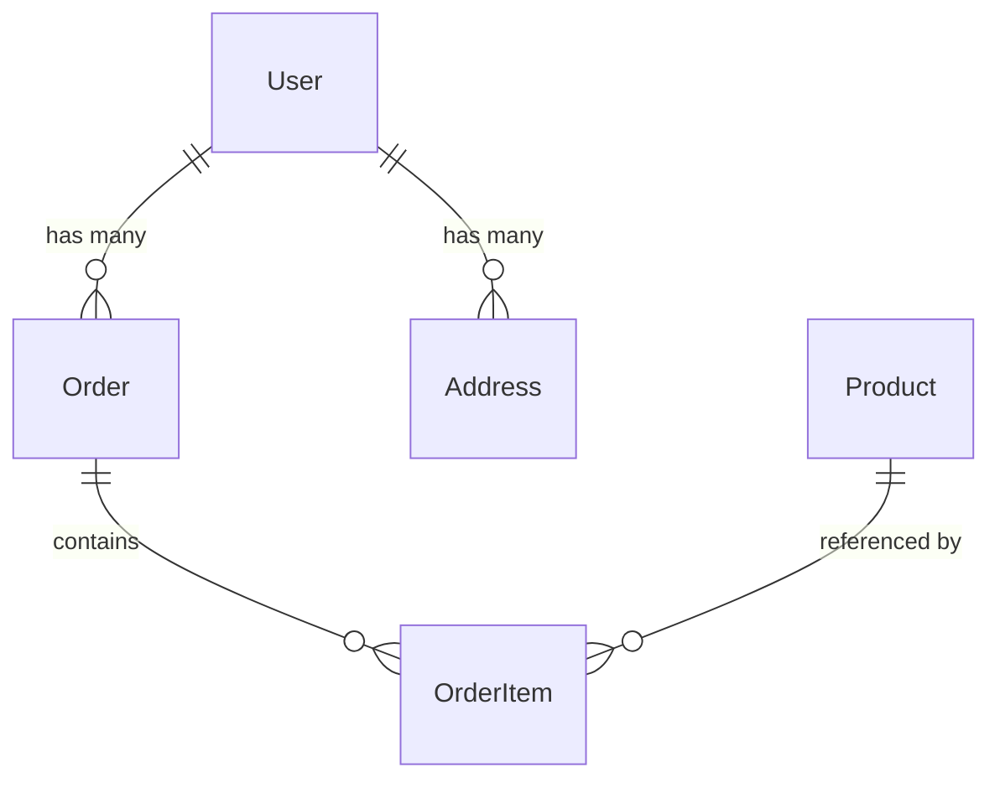

# Analyze Entities Command

## Contents

- Analysis Requirements
- Output Format

You are a software architect. Analyze the codebase to identify and document all common data entities and domain models.

> [!important] Special Instruction
> Ignore any files under `arch-docs` folder.

## Analysis Requirements

### 1. Entity Identification

Scan for data entities in:
- **ORM Models**: Django models, SQLAlchemy, TypeORM, Prisma, Eloquent, ActiveRecord, Entity Framework
- **Data Classes**: Python dataclasses, Kotlin data classes, Java records
- **Type Definitions**: TypeScript interfaces/types, Go structs, Rust structs
- **Schema Definitions**: JSON Schema, GraphQL types, Protobuf messages
- **Database Migrations**: Table definitions, column specifications
- **API DTOs**: Request/response objects, transfer objects

### 2. For Each Entity Document

#### Entity: [Name]

**Location:**
- File: `path/to/file.ext`
- Line(s): [line numbers]

**Purpose:** [Brief description of what this entity represents]

**Attributes:**

| Field | Type | Required | Description |
|-------|------|----------|-------------|
| id | UUID/integer | Yes | Primary identifier |
| name | string | Yes | [description] |
| created_at | datetime | Yes | Creation timestamp |

**Relationships:**

| Related Entity | Relationship Type | Foreign Key | Description |
|----------------|-------------------|-------------|-------------|
| User | Many-to-One | user_id | Owner of this entity |
| Tag | Many-to-Many | - | Associated tags |

**Validation Rules:**
- [List any validation constraints]

**Business Rules:**
- [List any domain logic associated with this entity]

### 3. Entity Relationship Diagram

Provide a text-based representation of entity relationships:

### 4. Entity Categories

Group entities by domain/bounded context:

#### User Domain
- User
- Profile
- Address

#### Order Domain
- Order
- OrderItem
- Payment

#### Product Domain
- Product
- Category
- Inventory

### 5. Common Patterns

Identify and document:
- **Base Classes**: Common parent entities (BaseModel, TimestampedModel)
- **Mixins**: Shared behaviors (AuditMixin, SoftDeleteMixin)
- **Value Objects**: Immutable domain objects (Money, Address)
- **Aggregates**: Aggregate roots and their boundaries
- **Enums**: Status values, type classifications

## Output Format

### Domain Model Overview

| Entity | Category | Key Fields | Primary Relationships |
|--------|----------|------------|----------------------|
| User | Core | id, email, name | Orders, Addresses |
| Order | Commerce | id, total, status | User, OrderItems |

### Detailed Entity Documentation

[For each entity, provide the detailed documentation as specified above]

### Entity Statistics

| Metric | Count |
|--------|-------|
| Total Entities | X |
| Aggregate Roots | X |
| Value Objects | X |
| Join Tables | X |

### Architectural Observations

- **Domain Boundaries**: [Describe bounded contexts if apparent]
- **Naming Conventions**: [Document naming patterns]
- **Common Patterns**: [List design patterns used]
- **Potential Issues**: [Note any concerns with the model]

