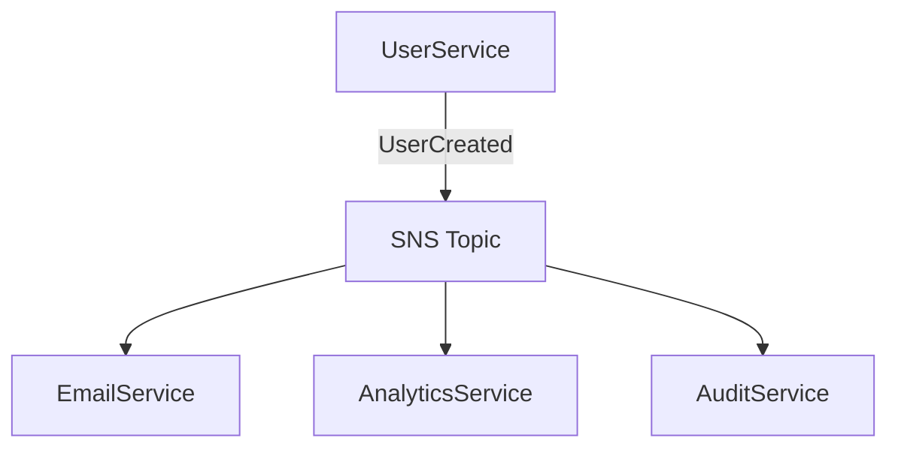

# Analyze Events Command

## Contents

- Event Analysis Requirements
- Output Format

You are an expert in event-driven architecture. Analyze this codebase to identify and document all event producers, consumers, message queues, and pub/sub patterns.

> [!important] Special Instruction
> If no event-driven mechanisms are found, return `no events`. Only document event systems that are ACTUALLY implemented in the codebase. Do NOT list event platforms or tools that are not present.
> [!important] Special Instruction
> Ignore any files under `arch-docs` folder.

## Event Analysis Requirements

### 1. Event Infrastructure Detection

Identify event systems in use:

#### Cloud Message Services
- **AWS**: SQS, SNS, EventBridge, Kinesis
- **Azure**: Service Bus, Event Hubs, Event Grid
- **GCP**: Pub/Sub, Cloud Tasks

#### Message Brokers
- **Kafka**: Apache Kafka, Confluent
- **RabbitMQ**: AMQP messaging
- **Redis**: Pub/Sub, Streams
- **NATS**: NATS, NATS Streaming, JetStream

#### In-Process Events
- **EventEmitter**: Node.js events
- **Signals**: Django signals, Rails callbacks
- **Domain Events**: Custom event dispatchers
- **Mediator Pattern**: MediatR, custom implementations

### 2. Event Producers

For each event producer found:

---

### Producer: [Name/Component]

**Event Type:** [Event name]

**Location:**
- File: `path/to/file.ext`
- Function/Class: [name]
- Line(s): [line numbers]

**Trigger Conditions:**
- [When this event is produced]

**Event Payload:**
```json
{
  "eventType": "UserCreated",
  "timestamp": "2024-01-01T00:00:00Z",
  "data": {
    "userId": "uuid",
    "email": "string",
    "name": "string"
  }
}
```

**Destination:**
- Queue/Topic: [name]
- Exchange: [if RabbitMQ]
- Partition Key: [if Kafka]

**Code Example:**
```[language]
// Actual code showing event publishing
```

---

### 3. Event Consumers

For each event consumer found:

---

### Consumer: [Name/Component]

**Event Type(s):** [Event names consumed]

**Location:**
- File: `path/to/file.ext`
- Function/Class: [name]

**Source:**
- Queue/Topic: [name]
- Subscription: [if applicable]

**Processing Logic:**
- [What happens when event is received]

**Error Handling:**
- Retry policy: [if configured]
- Dead letter queue: [if configured]
- Error logging: [approach]

**Code Example:**
```[language]
// Actual code showing event consumption
```

---

### 4. Event Catalog

List all events in the system:

| Event Name | Producer | Consumer(s) | Purpose |
|------------|----------|-------------|---------|
| UserCreated | UserService | EmailService, AnalyticsService | New user notification |
| OrderPlaced | OrderService | InventoryService, PaymentService | Order processing |
| PaymentCompleted | PaymentService | OrderService, NotificationService | Payment confirmation |

### 5. Event Flow Diagrams

Document event flows:



### 6. Message Queue Configuration

Document queue/topic configurations:

#### Queue: [Name]

| Setting | Value |
|---------|-------|
| Visibility Timeout | 30s |
| Message Retention | 4 days |
| Max Receive Count | 3 |
| Dead Letter Queue | [name] |
| FIFO | Yes/No |

### 7. Event Schemas

If schema registry or validation is used:
- **Schema Format**: Avro, JSON Schema, Protobuf
- **Schema Registry**: Confluent, AWS Glue, custom
- **Validation**: Where and how schemas are enforced

### 8. Reliability Patterns

Document:
- **At-least-once delivery**: Idempotency handling
- **Exactly-once processing**: Transaction outbox pattern
- **Ordering guarantees**: Partition keys, FIFO queues
- **Backpressure handling**: Consumer scaling

### 9. Monitoring & Observability

Identify:
- **Metrics**: Queue depth, processing time, error rates
- **Tracing**: Correlation IDs, distributed tracing
- **Alerting**: Dead letter queue alerts, lag monitoring

## Output Format

### Event Infrastructure Overview

| System | Type | Purpose | SDK/Library |
|--------|------|---------|-------------|
| AWS SQS | Queue | Async processing | @aws-sdk/client-sqs |
| Redis | Pub/Sub | Real-time events | ioredis |
| EventEmitter | In-process | Internal events | Node.js built-in |

### Event Catalog

[Complete table of all events]

### Event Flow Diagrams

[Visual representation of event flows]

### Detailed Documentation

[For each producer and consumer, provide detailed documentation]

### Summary

- **Event Systems Used:** [list]
- **Total Events Defined:** [count]
- **Producers:** [count]
- **Consumers:** [count]
- **Dead Letter Queues:** [count]
- **Architecture Pattern:** [Event Sourcing / CQRS / Simple Pub-Sub / etc.]


