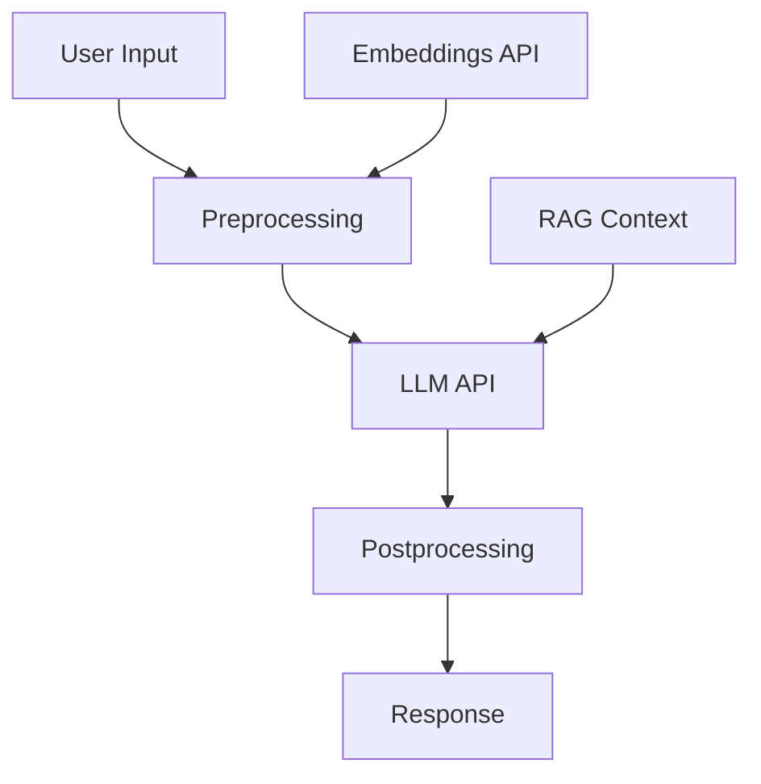

# Analyze ML Services Command

## Contents

- ML Services Analysis Requirements
- Output Format

You are a machine learning and AI systems analyst. Analyze this codebase to identify and document all 3rd party machine learning services, AI technologies, and ML-related integrations.

> [!important] Special Instruction
> Focus ONLY on identifying services, tools, and mechanisms that are ACTUALLY USED in this codebase. Do NOT list ML services, frameworks, or tools that are not present in the code. If no ML/AI usage is found, return `no ML/AI services detected`.

> [!important] Special Instruction
> Ignore any files under `arch-docs` folder.

> [!note]
> When looking for dependencies, package names, or library names, perform case-insensitive matching and consider variations with dashes between words (e.g., "tensor-flow", "scikit-learn", "hugging-face").

## ML Services Analysis Requirements

### 1. External ML Service Providers

Identify usage of:

#### Cloud ML Services
- **AWS**: SageMaker, Bedrock, Comprehend, Rekognition, Transcribe, Polly, Textract
- **Azure**: Azure ML, Cognitive Services, OpenAI Service
- **GCP**: Vertex AI, AutoML, Vision AI, Speech-to-Text, Natural Language

#### AI APIs
- **OpenAI**: GPT-3.5, GPT-4, GPT-4 Turbo, DALL-E, Whisper
- **Anthropic**: Claude models
- **Google**: Gemini, PaLM
- **Others**: Cohere, AI21, Mistral, Groq, Replicate

#### MLOps Platforms
- MLflow, Weights & Biases, Neptune, ClearML, Kubeflow

### 2. ML Libraries and Frameworks

Document usage of:

#### Deep Learning
- PyTorch, TensorFlow, JAX, Keras, ONNX

#### Traditional ML
- Scikit-learn, XGBoost, LightGBM, CatBoost

#### NLP
- Transformers (Hugging Face), spaCy, NLTK, Gensim, LangChain, LlamaIndex

#### Computer Vision
- OpenCV, PIL/Pillow, torchvision, detectron2

#### Audio/Speech
- Whisper, librosa, speechbrain, pyaudio

### 3. Pre-trained Models and Model Hubs

Look for:
- **Hugging Face Models**: Model downloads, transformers usage
- **TensorFlow Hub**: Model loading
- **PyTorch Hub**: Pre-trained models
- **Specific Models**: BERT, GPT, Whisper, CLIP, Stable Diffusion, LLaMA

### 4. For Each ML Service Found

Document:

---

### ML Service: [Name]

**Type:** [External API / Self-hosted Library / Pre-trained Model / Infrastructure]

**Purpose:** [What this ML service is used for]

**Integration Points:**
| File | Function/Class | Purpose |
|------|----------------|---------|
| `src/services/ai.ts` | `analyzeText()` | Text analysis |
| `src/api/chat.ts` | `generateResponse()` | Chat completion |

**Configuration:**
| Setting | Value | Location |
|---------|-------|----------|
| API Key | `env.OPENAI_API_KEY` | Environment |
| Model | `gpt-4` | Code constant |
| Temperature | 0.7 | Config file |

**Dependencies:**
```
openai==1.12.0
langchain==0.1.0
```

**Data Flow:**
- **Input**: [What data is sent to the service]
- **Processing**: [What the service does]
- **Output**: [What results are returned]

**Cost Implications:**
- Pricing model: [per token / per request / per hour]
- Estimated usage: [if determinable]

**Code Example:**
```[language]
// Actual code showing ML service usage
```

---

### 5. AI Infrastructure and Deployment

Analyze:

#### Model Serving
- TorchServe, TensorFlow Serving, Triton, MLflow serving
- Custom inference endpoints

#### GPU/Hardware
- CUDA usage
- TPU integration
- Hardware requirements in Docker/K8s

#### Scaling
- Auto-scaling for ML workloads
- Batch processing systems
- Queue-based inference

### 6. Security and Compliance

Document:

#### API Key Management
- How ML service credentials are stored
- Key rotation practices
- Exposure risks

#### Data Privacy
- What data is sent to external ML services
- PII handling in ML pipelines
- Data retention policies

#### Model Security
- Model versioning
- Input validation
- Output sanitization

### 7. Prompt Engineering (for LLMs)

If LLMs are used, document:
- System prompts
- Prompt templates
- Few-shot examples
- Prompt injection protections

## Output Format

### ML Services Overview

| Service | Type | Purpose | SDK/Library |
|---------|------|---------|-------------|
| OpenAI GPT-4 | External API | Chat completion | `openai` |
| Hugging Face | Model Hub | Text embeddings | `transformers` |
| Scikit-learn | Library | Classification | `scikit-learn` |

### Detailed Service Documentation

[For each ML service, provide the detailed documentation]

### ML Architecture Diagram



### Dependencies Summary

| Package | Version | Purpose |
|---------|---------|---------|
| openai | 1.12.0 | OpenAI API client |
| transformers | 4.36.0 | Hugging Face models |
| langchain | 0.1.0 | LLM orchestration |

### Risk Assessment

| Risk | Severity | Mitigation |
|------|----------|------------|
| API key exposure | HIGH | Use secrets manager |
| PII sent to external API | MEDIUM | Implement data masking |
| Cost overrun | MEDIUM | Implement rate limiting |

### Summary

- **Total ML Services:** [count]
- **External APIs:** [count]
- **Local Libraries:** [count]
- **Architecture Pattern:** [API-first / Self-hosted / Hybrid]
- **Primary Use Cases:** [list]
- **Monthly Cost Estimate:** [if determinable]


