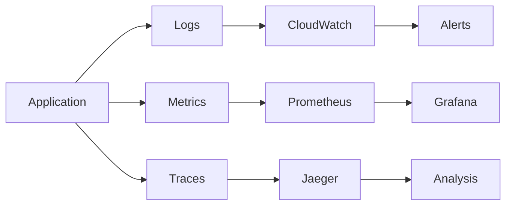

# Analyze Monitoring Command

## Contents

- Monitoring Analysis Requirements
- Output Format

You are an observability and SRE specialist. Analyze this codebase to identify and document all monitoring, logging, metrics, tracing, and alerting implementations.

> [!important] Special Instruction
> If no monitoring or observability mechanisms are detected, return `no monitoring or observability detected`. Only document systems that are ACTUALLY implemented in the codebase. Do NOT list monitoring tools or platforms that are not present.
> [!important] Special Instruction
> Ignore any files under `arch-docs` folder.
> [!note]
> When looking for dependencies, package names, or library names, perform case-insensitive matching and consider variations with dashes between words (e.g., "new-relic", "data-dog", "express-rate-limit").

## Monitoring Analysis Requirements

### 1. Monitoring Platform Detection

Identify monitoring tools in use:

#### APM (Application Performance Monitoring)
- **Datadog**: `dd-trace`, `datadog-metrics`
- **New Relic**: `newrelic`
- **Dynatrace**: Dynatrace SDK
- **AppDynamics**: AppDynamics agent
- **Elastic APM**: `elastic-apm-node`

#### Logging Platforms
- **ELK Stack**: Elasticsearch, Logstash, Kibana
- **Splunk**: Splunk SDK
- **Datadog Logs**: DD log integration
- **CloudWatch Logs**: AWS SDK
- **Loki/Grafana**: Loki client

#### Metrics Systems
- **Prometheus**: `prom-client`, Prometheus exporters
- **StatsD**: StatsD client
- **InfluxDB**: InfluxDB client
- **CloudWatch Metrics**: AWS SDK

#### Tracing
- **OpenTelemetry**: `@opentelemetry/*`
- **Jaeger**: Jaeger client
- **Zipkin**: Zipkin tracer
- **X-Ray**: AWS X-Ray SDK

### 2. Logging Implementation

Document logging setup:

---

### Logging Framework: [Name]

**Library:** [package name]

**Configuration:**
```[language]
// Logger initialization code
```

**Log Levels Used:**
| Level | Usage | Example |
|-------|-------|---------|
| ERROR | Exceptions, failures | `logger.error('Failed to process', error)` |
| WARN | Potential issues | `logger.warn('Retry attempt', { attempt })` |
| INFO | Important events | `logger.info('User created', { userId })` |
| DEBUG | Development details | `logger.debug('Request payload', payload)` |

**Structured Logging:**
```json
{
  "timestamp": "2024-01-01T00:00:00Z",
  "level": "INFO",
  "message": "User created",
  "userId": "123",
  "correlationId": "abc-123"
}
```

**Log Destinations:**
| Destination | Purpose |
|-------------|---------|
| Console | Local development |
| File | Persistent logs |
| CloudWatch | Production monitoring |

---

### 3. Metrics Implementation

Document metrics collection:

---

### Metrics System: [Name]

**Library:** [package name]

**Metric Types Used:**

#### Counters
| Metric Name | Labels | Purpose |
|-------------|--------|---------|
| `http_requests_total` | method, path, status | Request counting |
| `errors_total` | type, service | Error tracking |

#### Gauges
| Metric Name | Labels | Purpose |
|-------------|--------|---------|
| `active_connections` | service | Connection pool |
| `queue_size` | queue_name | Queue depth |

#### Histograms
| Metric Name | Buckets | Purpose |
|-------------|---------|---------|
| `http_request_duration_seconds` | [0.1, 0.5, 1, 5] | Request latency |
| `db_query_duration_seconds` | [0.01, 0.1, 1] | DB performance |

**Instrumentation Points:**
```[language]
// Code showing metric recording
```

---

### 4. Distributed Tracing

Document tracing implementation:

---

### Tracing System: [Name]

**Library:** [package name]

**Instrumentation:**
| Component | Auto/Manual | Purpose |
|-----------|-------------|---------|
| HTTP Server | Auto | Incoming requests |
| HTTP Client | Auto | Outgoing requests |
| Database | Auto | Query tracing |
| Custom spans | Manual | Business logic |

**Context Propagation:**
- Header format: `traceparent`, `x-trace-id`
- Baggage items: [list if used]

**Sampling Strategy:**
- Rate: [percentage or rule]
- Configuration: [where defined]

**Code Example:**
```[language]
// Code showing span creation
```

---

### 5. Health Checks

Document health endpoints:

| Endpoint | Type | Checks |
|----------|------|--------|
| `/health` | Liveness | App is running |
| `/ready` | Readiness | Dependencies available |
| `/health/detailed` | Detailed | Component-level status |

**Health Check Components:**
| Component | Check Type | Timeout |
|-----------|------------|---------|
| Database | Connection | 5s |
| Redis | Ping | 2s |
| External API | HTTP | 10s |

### 6. Alerting Configuration

Document alerting setup:

#### Alert Rules

| Alert Name | Condition | Severity | Action |
|------------|-----------|----------|--------|
| High Error Rate | error_rate > 5% | Critical | PagerDuty |
| Slow Response | p99 > 2s | Warning | Slack |
| Service Down | health != ok | Critical | PagerDuty |

#### Notification Channels
| Channel | Purpose | Configuration |
|---------|---------|---------------|
| PagerDuty | Critical alerts | `PAGERDUTY_KEY` |
| Slack | Warnings | `#alerts` channel |
| Email | Daily summaries | ops@company.com |

### 7. Dashboard and Visualization

Identify dashboard configurations:
- Grafana dashboards (JSON files)
- Datadog dashboard definitions
- CloudWatch dashboards
- Custom admin panels

### 8. Error Tracking

Document error tracking:

#### Error Tracking Service: [Name]

**Library:** [Sentry, Bugsnag, Rollbar, etc.]

**Configuration:**
| Setting | Value |
|---------|-------|
| DSN | `env.SENTRY_DSN` |
| Environment | `env.NODE_ENV` |
| Release | `env.GIT_SHA` |

**Error Context:**
- User context attached
- Custom tags
- Breadcrumbs

### 9. Performance Monitoring

Document performance tracking:
- Response time tracking
- Database query performance
- External API latency
- Resource utilization

## Output Format

### Observability Overview

| Category | Tool | Status |
|----------|------|--------|
| Logging | Winston + CloudWatch | ✅ Implemented |
| Metrics | Prometheus | ✅ Implemented |
| Tracing | OpenTelemetry | ✅ Implemented |
| Error Tracking | Sentry | ✅ Implemented |
| Alerting | PagerDuty | ✅ Implemented |

### Detailed Documentation

[For each observability component, provide the detailed documentation]

### Observability Architecture



### Coverage Assessment

| Component | Logging | Metrics | Tracing |
|-----------|---------|---------|---------|
| API Layer | ✅ | ✅ | ✅ |
| Services | ✅ | ⚠️ Partial | ✅ |
| Database | ❌ | ✅ | ✅ |
| External APIs | ✅ | ✅ | ⚠️ Partial |

### Summary

- **Primary Monitoring Platform:** [name]
- **Log Aggregation:** [system]
- **Metrics Backend:** [system]
- **Tracing Backend:** [system]
- **Alert Channels:** [list]
- **Coverage Assessment:** [Good / Partial / Needs Improvement]


