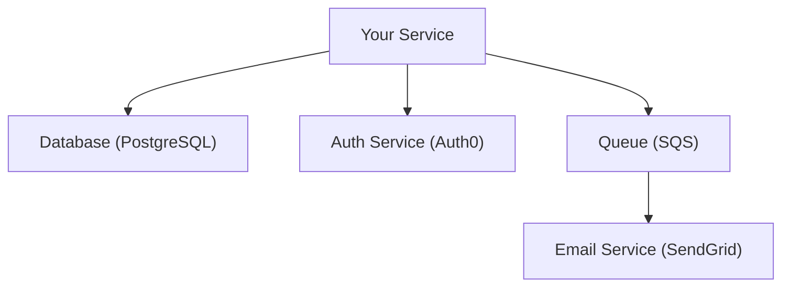

# Analyze Service Dependencies Command

## Contents

- Service Dependency Analysis Requirements
- Output Format

You are an expert software architect. Analyze this codebase to identify and document all service-to-service dependencies, both internal and external integrations.

> [!important] Special Instruction
> Focus ONLY on runtime service dependencies that are ACTUALLY present in the code. Do NOT list services or integrations that are not implemented.

> [!important] Special Instruction
> Ignore any files under `arch-docs` folder.

> [!note]
> When looking for dependencies, package names, or library names, perform case-insensitive matching and consider variations with dashes between words.

## Service Dependency Analysis Requirements

### 1. Internal Service Dependencies

Identify services within the same organization/system:

#### Microservices Communication
- HTTP/REST calls between services
- gRPC communication
- GraphQL federation
- Message queue interactions

#### Shared Libraries/Packages
- Internal npm packages (`@company/*`)
- Private PyPI packages
- Maven/Gradle internal artifacts

### 2. External Service Dependencies

#### API Integrations
Document all third-party API calls:

| Service | Purpose | Protocol | Auth Method |
|---------|---------|----------|-------------|
| Stripe | Payments | REST | API Key |
| SendGrid | Email | REST | API Key |
| Twilio | SMS | REST | API Key |
| Google Maps | Geocoding | REST | API Key |

#### Cloud Services
- **AWS**: S3, SQS, SNS, Lambda, DynamoDB, RDS, etc.
- **Azure**: Blob Storage, Service Bus, Functions, etc.
- **GCP**: Cloud Storage, Pub/Sub, Cloud Functions, etc.

#### SaaS Integrations
- CRM (Salesforce, HubSpot)
- Analytics (Segment, Mixpanel, Amplitude)
- Support (Zendesk, Intercom)
- Auth providers (Auth0, Okta)

### 3. For Each Dependency Document

---

### Service: [Name]

**Type:** [Internal Service / External API / Cloud Service / SaaS]

**Purpose:** [What this service is used for]

**Integration Points:**

| File | Function/Class | Usage |
|------|----------------|-------|
| `src/services/payment.ts` | `processPayment()` | Charge customer |
| `src/webhooks/stripe.ts` | `handleWebhook()` | Process events |

**Communication:**
| Aspect | Details |
|--------|---------|
| Protocol | REST / gRPC / GraphQL / WebSocket |
| Base URL | `api.service.com` or `env.SERVICE_URL` |
| Authentication | API Key / OAuth / JWT / mTLS |
| Rate Limits | [if known] |

**Configuration:**
| Setting | Source | Purpose |
|---------|--------|---------|
| `STRIPE_API_KEY` | Environment | API authentication |
| `STRIPE_WEBHOOK_SECRET` | Environment | Webhook validation |

**Endpoints Used:**
| Method | Endpoint | Purpose |
|--------|----------|---------|
| POST | `/v1/charges` | Create charge |
| GET | `/v1/customers/{id}` | Fetch customer |
| POST | `/v1/refunds` | Process refund |

**Error Handling:**
- Retry policy: [describe]
- Timeout: [value]
- Circuit breaker: [if implemented]
- Fallback behavior: [if any]

**Code Example:**
```[language]
// Actual integration code
```

---

### 4. Dependency Graph

Create a visual representation:



### 5. Health Dependencies

Document health/availability dependencies:

| Service | Criticality | Degraded Mode | Health Check |
|---------|-------------|---------------|--------------|
| Database | Critical | None - service fails | `/health/db` |
| Redis | High | Bypass cache | `/health/cache` |
| Stripe | Medium | Disable payments | None |
| SendGrid | Low | Queue emails | None |

### 6. Data Flow Analysis

Document data flowing between services:

#### Outbound Data

| Destination | Data Type | PII | Encryption |
|-------------|-----------|-----|------------|
| Stripe | Payment info | Yes | TLS |
| SendGrid | Email, Name | Yes | TLS |
| Analytics | User events | Anonymized | TLS |

#### Inbound Data

| Source | Data Type | Validation |
|--------|-----------|------------|
| Auth0 | JWT tokens | Signature verification |
| Stripe webhooks | Payment events | Signature verification |

### 7. Authentication & Authorization

| Service | Auth Method | Credentials Storage | Rotation |
|---------|-------------|---------------------|----------|
| Stripe | API Key | Secrets Manager | Manual |
| Auth0 | OAuth + JWT | N/A (external) | Auto |
| Internal API | mTLS | Certificate store | 90 days |

### 8. Resilience Patterns

Document resilience implementations:

#### Circuit Breakers

| Service | Library | Threshold | Timeout |
|---------|---------|-----------|---------|
| Payment API | opossum | 5 failures | 30s |
| Email API | custom | 3 failures | 60s |

#### Retry Policies

| Service | Max Retries | Backoff | Conditions |
|---------|-------------|---------|------------|
| Database | 3 | Exponential | Connection errors |
| External API | 2 | Linear | 5xx errors |

#### Timeouts

| Service | Connect | Read | Total |
|---------|---------|------|-------|
| Payment API | 5s | 30s | 35s |
| Internal API | 2s | 10s | 12s |

### 9. Monitoring & Observability

| Service | Metrics | Logging | Tracing |
|---------|---------|---------|---------|
| Database | Connection pool, query time | Query logs | Span per query |
| Stripe | Request count, latency | Request/response | External span |
| SQS | Queue depth, processing time | Message logs | Message trace |

## Output Format

### Service Dependency Overview

| Service | Type | Criticality | Protocol | Status |
|---------|------|-------------|----------|--------|
| PostgreSQL | Database | Critical | TCP | Internal |
| Auth0 | Auth Provider | Critical | HTTPS | External |
| Stripe | Payment | High | HTTPS | External |
| Redis | Cache | Medium | TCP | Internal |
| SendGrid | Email | Low | HTTPS | External |

### Dependency Graph

[ASCII diagram showing service relationships]

### Detailed Service Documentation

[For each service, provide the detailed documentation]

### Risk Assessment

| Risk | Services Affected | Mitigation |
|------|-------------------|------------|
| Single point of failure | Database | Read replicas |
| Vendor lock-in | AWS services | Abstract with interfaces |
| Rate limiting | Stripe, SendGrid | Queue and batch |

### Summary

- **Total Dependencies:** [count]
- **Internal Services:** [count]
- **External APIs:** [count]
- **Cloud Services:** [count]
- **Critical Dependencies:** [list]
- **Single Points of Failure:** [list]


